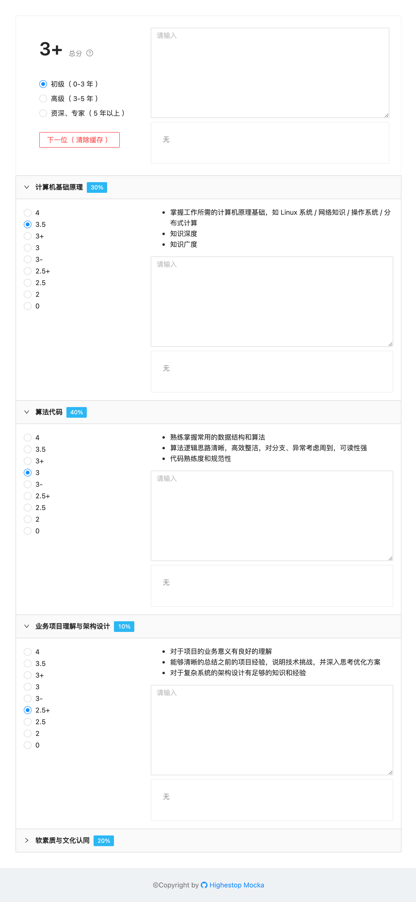

# Mocka

Mocka（ Mock for Moka ）是一套在 [Moka 招聘系统](https://www.mokahr.com/) 面试反馈功能上做的一些定制化扩展页面

## 功能

- 能对若干考察点（ Perspective ）分别进行反馈填写及打分（ Score ）
- 考察点会有相应的权重（ Weight ），根据权重及其分数，自动计算出综合得分（ Credit ）
- 支持选择期望（ Expectation ），不同期望中各项考察点的权重比例会不同，综合得分也就不同

## 界面



## 配置

### 考察点（ Perspective ）

```json
{
  "key": "basis", // 标识
  "title": "计算机基础原理", // 标题
  "desc": [
    "掌握工作所需的计算机原理基础，如 Linux 系统 / 网络知识 / 操作系统 / 分布式计算",
    "知识深度",
    "知识广度"
  ] // 多行描述，以 Bullet List 方式展示
}
```

### 分值（ Score、Credit ）

```json
{
  "score": "3-", // 展示的分数
  "value": 2.83, // 实际的分值
  "desc": "基本符合平均水平，可以招" // 分数描述信息
}
```

### 期望水平（ Expectation ）

```json
{
  "name": "junior", // 期望水平
  "desc": "初级（ 0-3 年 ）", // 期望水平描述
  "basis": 0.3, // 各个考察点相应的权重值
  "algo": 0.4,
  "project": 0.1,
  "culture": 0.2
}
```

## 计算

见页面说明及代码注释

## 优化

- 清楚缓存按钮会有提示（ 清除页面所有填写数据和浏览器缓存数据 ），同时会有二次确认，避免误点
- 各项考察点的反馈记录及打分、综合评价内容、当前的期望，均会使用浏览器缓存，避免不小心刷新界面丢失数据
- 各项卡片支持收起，但默认均为展开状态
- 具体的计算中间过程，均会在控制台打印日志，可以根据控制台信息核实结果是否合理
